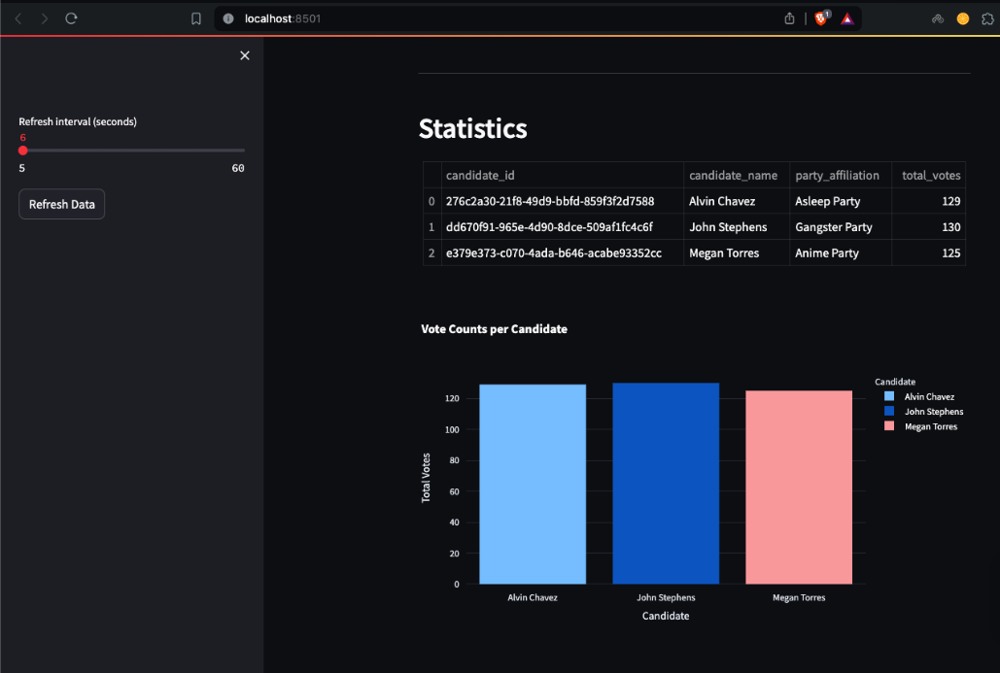

Real-Time Election Monitoring System
===================================
This repository contains the code for a realtime election monitoring system. The system is built using Python, Kafka, PostgreSQL, and Streamlit. Docker Compose is used to easily spin up the required services in Docker containers.

## Table of Contents
- [Project Scope](#project-scope)
- [Project Objectives](#project-objectives)
- [System Architecture](#system-architecture)
- [System Components](#system-components)
- [Setup Instructions](#setup-instructions)
- [Dashboard Overview](#dashboard-overview)
- [Contributing](#contributing)
- [License](#license)
- [Screenshots](#screenshots)

## Project Scope
The project aims to develop a scalable and reliable end-to-end solution for conducting and monitoring elections in real-time, ensuring transparency of election processes. Utilizing randomuser.me api to generate fake candidate, voter, and vote data to simulate real-world election data, PostgreSQL for robust database management, Apache Kafka for efficient data streaming, and Streamlit for a user-friendly dashboard interface, the system facilitates seamless integration and handling of voting data. This project focuses on scalability, data integrity, security, and providing election officials with an up-to-date, accurate representation of election results, ultimately enhancing the efficiency and trustworthiness of the election process. The deployment using Docker Compose ensures easy setup and scalability across different environments.

## Project Objectives
1. **Real-time Data Processing and Monitoring:** Leverages Kafka to stream voting data in real-time, allowing for immediate updates and monitoring of election results as votes are cast, ensuring transparency and timely insights.

2. **Data Integrity and Security:** PostgreSQL is a robust database management system that securely stores voter, candidate, and voting data, safeguarding against unauthorized access and ensuring the integrity and accuracy of the election data.

3. **Scalability and Flexibility:** Docker Compose for containerized deployment, ensuring the system can be easily scaled and adapted to different environments and varying loads, making it suitable for elections of any size.

4. **Provide a User-friendly Interface:** Develop an intuitive and interactive Streamlit-based dashboard that presents election data in a clear and accessible manner, enabling election officials and stakeholders to easily monitor and analyze voting trends and outcomes.

## System Architecture


## System Components
- **docker-compose.yml**: This file defines the multi-container Docker application, including configurations for Kafka (for real-time data streaming) and PostgreSQL (for storing voters, candidates, and votes data) etc.
- **main.py**: This is the main Python script that creates the required tables on postgres (`candidates`, `voters` and `votes`), it also creates the Kafka topic and creates a copy of the `votes` table in the Kafka topic. It also contains the logic to consume the votes from the Kafka topic and produce data to `voters_topic` on Kafka.
- **voting.py**: This is the Python script that contains the logic to consume the votes from the Kafka topic (`voters_topic`), generate voting data and produce data to `votes_topic` on Kafka.
- **streamlit-app.py**: This is the Python script that contains the logic to consume the voting data from the Kafka topic as well as postgres and display the voting data in realtime using Streamlit, using a simple UI.
- **requirements.txt**: This file lists all the dependencies required for the project. Use `pip install -r requirements.txt` to install these dependencies.

## Setup Instructions

### Prerequisites
- Python 3.8 or above installed on your machine
- Docker installed and running on your machine
- Install dependencies (`requirements.txt`)

### Steps to Run
1. Clone this repository.
```bash
git clone https://github.com/fyxx10/realtime_voting.git
```
2. Create a virtual environment.
```bash
python3 -m venv name_of_virtual_environment
```

3. Activate the virtual environment.
```bash
source name_of_virtual_environment/bin/activate
```

4. Install the required dependencies.
```bash
pip install -r requirements.txt
```

5. Run the following command:
This command will start Zookeeper, Kafka and Postgres containers in detached mode (`-d` flag). Kafka will be accessible at `localhost:9092` and Postgres at `localhost:5433`.
```bash
docker-compose up -d
```

6. Run the Initial Setup Script:
This script will create the necessary tables in the PostgreSQL database, generate candidate and voter data, and produce initial data to Kafka topics.
```bash
python main.py
```

7. Start the Voting Simulation:
This script will consume voter data from Kafka, simulate votes, and produce voting data to Kafka topics.
```bash
python voting.py
```

8. Running the Streamlit app:
This script will start the Streamlit dashboard to visualize real-time election data.
```bash
streamlit run app.py
```

## Dashboard Overview

- **Total Voters, Candidates, and Votes:** Displays the total number of registered voters, candidates, and votes cast in real-time.
  
- **Leading Candidate:** Shows the candidate with the highest number of votes, including their name, party affiliation, and total votes received.
  
- **Statistics:** Provides detailed statistics on vote counts per candidate, including visualizations such as bar charts and donut charts for easy analysis.
  
- **Automatic and Manual Refresh:** The dashboard automatically refreshes data at a user-defined interval. Users can also manually refresh the data using the sidebar.


## Contributing

Contributions are welcome! Please follow these steps to contribute:

1. Fork the repository.
2. Create a new branch (`git checkout -b feature-branch`).
3. Make your changes and commit them (`git commit -m 'Add some feature'`).
4. Push to the branch (`git push origin feature-branch`).
5. Create a new Pull Request.


## License

This project is licensed under the MIT License - see the [LICENSE](LICENSE) file for details.


## Screenshots
### Candidates and Parties information


### Voters


### Voting


### Dashboard




### Sample Election Video


Thank you for using the Realtime Election Monitoring System! If you have any questions or need further assistance, please feel free to open an issue or contact the project maintainers.(felixnunoo9@gmail.com)
